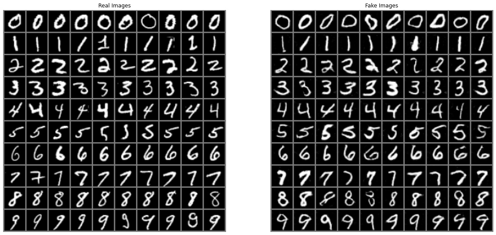

# 1. Target
Based on the `mnist` dataset, we will train a `cdcgan`(cgan+dcgan) to generate new controlled handwritten digit.
# 2. Environment
## 2.1. Python
Download: [https://www.python.org/downloads/](https://www.python.org/downloads/)
## 2.2. Pytorch
Download: [https://pytorch.org/get-started/locally/](https://pytorch.org/get-started/locally/)
## 2.3. Jupyter notebook
```bash
pip install jupyter
```
## 2.4. Matplotlib
```bash
pip install matplotlib
```
# 3. Implementation
## 3.1. Generator
### 3.1.1. Structure of Generator


### 3.9.2. Code
```python
class Generator(nn.Module):
    def __init__(self, ngpu):
        super(Generator, self).__init__()
        self.ngpu = ngpu
        self.image = nn.Sequential(
            # state size. (nz) x 1 x 1
            nn.ConvTranspose2d(nz, ngf * 4, 4, 1, 0, bias=False),
            nn.BatchNorm2d(ngf * 4),
            nn.ReLU(True)
            # state size. (ngf*4) x 4 x 4
        )
        self.label = nn.Sequential(
            # state size. (num_classes) x 1 x 1
            nn.ConvTranspose2d(num_classes, ngf * 4, 4, 1, 0, bias=False),
            nn.BatchNorm2d(ngf * 4),
            nn.ReLU(True)
            # state size. (ngf*4) x 4 x 4
        )
        self.main = nn.Sequential(
            # state size. (ngf*8) x 4 x 4
            nn.ConvTranspose2d(ngf * 8, ngf * 4, 4, 2, 1, bias=False),
            nn.BatchNorm2d(ngf * 4),
            nn.ReLU(True),
            # state size. (ngf*4) x 8 x 8
            nn.ConvTranspose2d(ngf * 4, ngf * 2, 4, 2, 1, bias=False),
            nn.BatchNorm2d(ngf * 2),
            nn.ReLU(True),
            # state size. (ngf*2) x 16 x 16
            nn.ConvTranspose2d(ngf*2, nc, 4, 2, 1, bias=False),
            nn.Tanh()
            # state size. (nc) x 32 x 32
        )

    def forward(self, image, label):
        image = self.image(image)
        label = self.label(label)
        incat = torch.cat((image, label), dim=1)
        return self.main(incat)
```
### 3.1.3. Instantiation of Generator
```python
# Create the generator
netG = Generator(ngpu).to(device)

# Handle multi-gpu if desired
if device.type == 'cuda' and ngpu > 1:
    netG = nn.DataParallel(netG, list(range(ngpu)))

# Apply the weights_init function to randomly initialize all weights to mean=0, stdev=0.2.
netG.apply(weights_init)
```
## 3.2. Discriminator
### 3.2.1. Structure of Discriminator


### 3.2.2. Code
```python
class Discriminator(nn.Module):
    def __init__(self, ngpu):
        super(Discriminator, self).__init__()
        self.ngpu = ngpu
        self.image = nn.Sequential(
            # input is (nc) x 32 x 32
            nn.Conv2d(nc, ndf, 4, 2, 1, bias=False),
            nn.LeakyReLU(0.2, inplace=True)
            # state size. (ndf) x 16 x 16
        )
        self.label = nn.Sequential(
            # input is (num_classes) x 32 x 32
            nn.Conv2d(num_classes, ndf, 4, 2, 1, bias=False),
            nn.LeakyReLU(0.2, inplace=True)
            # state size. (ndf) x 16 x 16
        )
        self.main = nn.Sequential(
            # state size. (ndf*2) x 16 x 16
            nn.Conv2d(ndf * 2, ndf * 4, 4, 2, 1, bias=False),
            nn.BatchNorm2d(ndf * 4),
            nn.LeakyReLU(0.2, inplace=True),
            # state size. (ndf*4) x 8 x 8
            nn.Conv2d(ndf * 4, ndf * 8, 4, 2, 1, bias=False),
            nn.BatchNorm2d(ndf * 8),
            nn.LeakyReLU(0.2, inplace=True),
            # state size. (ndf*8) x 4 x 4
            nn.Conv2d(ndf * 8, 1, 4, 1, 0, bias=False),
            # state size. (1) x 1 x 1
            nn.Sigmoid()
        )

    def forward(self, image, label):
        image = self.image(image)
        label = self.label(label)
        incat = torch.cat((image, label), dim=1)
        return self.main(incat)
```
### 3.2.3. Instantiation of Discriminator
```python
# Create the Discriminator
netD = Discriminator(ngpu).to(device)

# Handle multi-gpu if desired
if device.type == 'cuda' and ngpu > 1:
    netD = nn.DataParallel(netD, list(range(ngpu)))

# Apply the weights_init function to randomly initialize all weights to mean=0, stdev=0.2.
netD.apply(weights_init)
```
## 3.3. Training Result
```python
Starting Training Loop...
Epoch: [01/10] Step: [700/700] Loss-D: 0.7205 Loss-G: 1.8315 D(x): 0.7095 D(G(z)): [0.2365/0.2161] Time: 115s
Epoch: [02/10] Step: [700/700] Loss-D: 1.3231 Loss-G: 2.0508 D(x): 0.7644 D(G(z)): [0.5831/0.1654] Time: 116s
Epoch: [03/10] Step: [700/700] Loss-D: 1.5194 Loss-G: 2.6285 D(x): 0.8626 D(G(z)): [0.6982/0.0936] Time: 110s
Epoch: [04/10] Step: [700/700] Loss-D: 0.8259 Loss-G: 1.4162 D(x): 0.6474 D(G(z)): [0.2771/0.2739] Time: 111s
Epoch: [05/10] Step: [700/700] Loss-D: 0.4708 Loss-G: 2.3000 D(x): 0.8081 D(G(z)): [0.1971/0.1272] Time: 111s
Epoch: [06/10] Step: [700/700] Loss-D: 0.3941 Loss-G: 3.5506 D(x): 0.9606 D(G(z)): [0.2575/0.0391] Time: 118s
Epoch: [07/10] Step: [700/700] Loss-D: 0.1330 Loss-G: 3.4693 D(x): 0.9434 D(G(z)): [0.0690/0.0441] Time: 113s
Epoch: [08/10] Step: [700/700] Loss-D: 0.0821 Loss-G: 4.5200 D(x): 0.9502 D(G(z)): [0.0279/0.0196] Time: 112s
Epoch: [09/10] Step: [700/700] Loss-D: 0.1145 Loss-G: 2.5075 D(x): 0.9040 D(G(z)): [0.0084/0.1038] Time: 111s
Epoch: [10/10] Step: [700/700] Loss-D: 0.3325 Loss-G: 2.9338 D(x): 0.8902 D(G(z)): [0.1730/0.0727] Time: 111s
```
## 3.4. Loss versus training iteration


## 3.5. D(x) and D(G(z)) versus training iteration


## 3.6. Visualization of G’s progression


# 4. Real Images vs. Fake Images



# 5. Starting Training
> [cdcgan.ipynb](cdcgan.ipynb)

# 6. Paper
> Conditional Generative Adversarial Nets: [Download](https://arxiv.org/pdf/1411.1784.pdf)
> UNSUPERVISED REPRESENTATION LEARNING WITH DEEP CONVOLUTIONAL GENERATIVE ADVERSARIAL NETWORKS: [Download](https://papers.nips.cc/paper/5423-generative-adversarial-nets.pdf)
# 7. Cite
> [https://github.com/znxlwm/pytorch-MNIST-CelebA-cGAN-cDCGAN](https://github.com/znxlwm/pytorch-MNIST-CelebA-cGAN-cDCGAN)